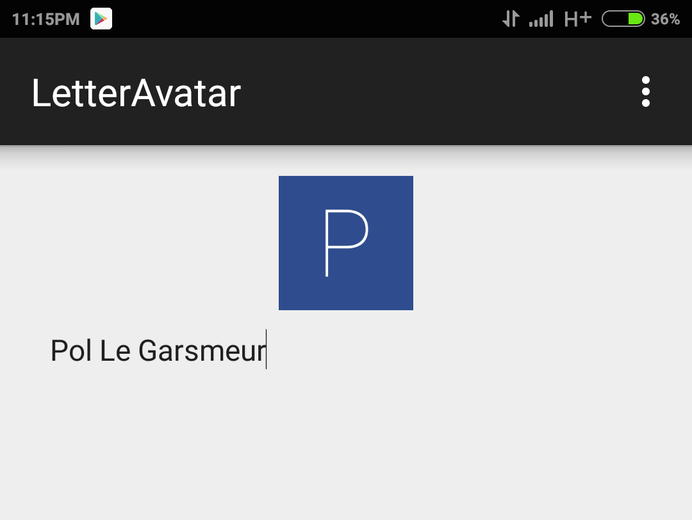

# LetterAvatar
Android library to generate an unique avatar based on the name of the user.
The formula to define the color can basically be sumed up with this:

```java
"#" + md5(userName).substring(0, 6)
```

## How to install
Either
- Copy past the source in your project (do not forget the font asset.)
- import the module
- include [the aar](https://github.com/legarspol/LetterAvatar/raw/master/assets/letteravatar-release.aar) in your project

then call 

```java
Bitmap bm = LetterAvatar.createAvatar(context, userName);
or
Bitmap bm =  LetterAvatar.createAvatar( context, userName, imageWidth, paddinginDP) {
or
String color = LetterAvatar.getColor(userName);
```


